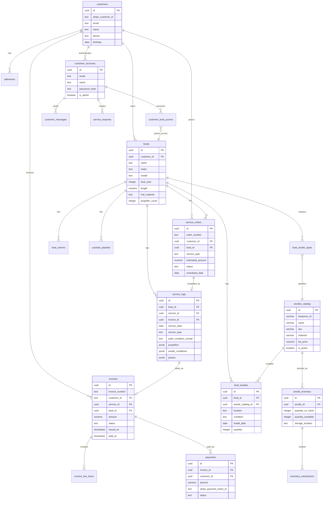
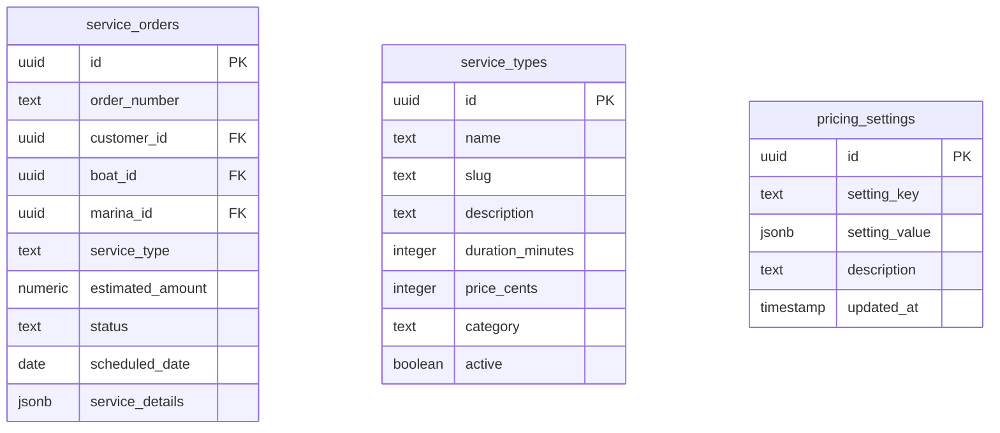
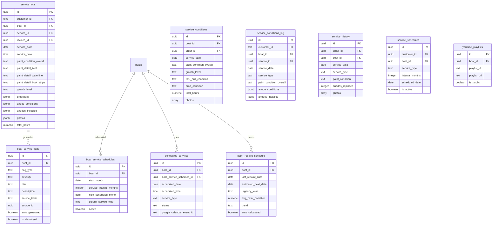
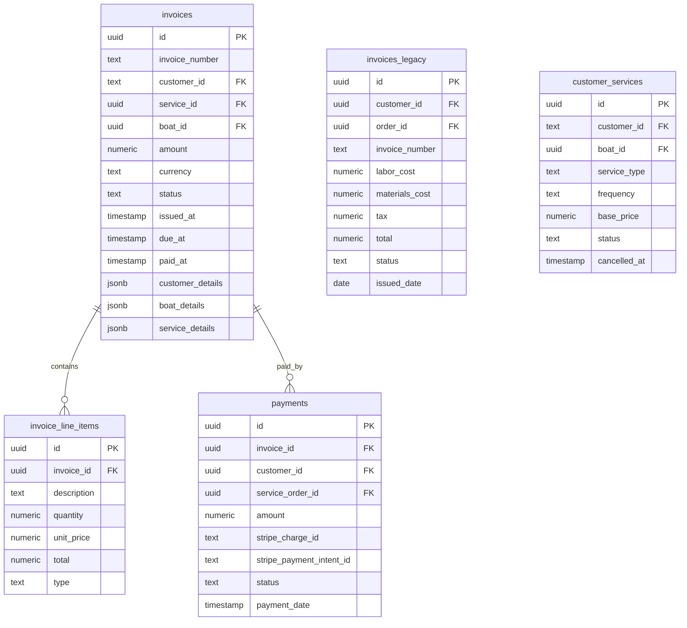
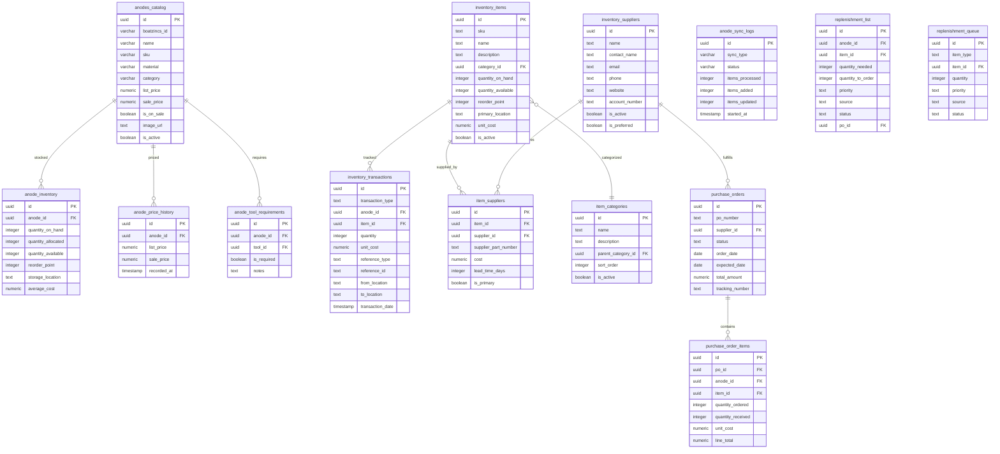
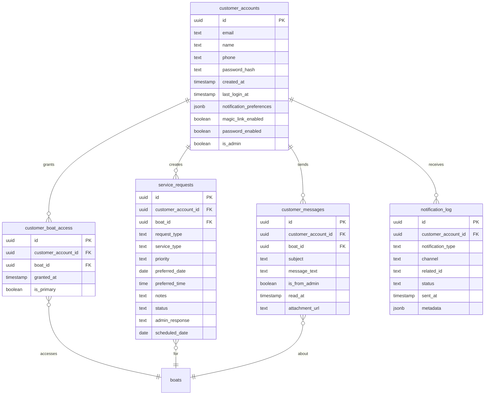
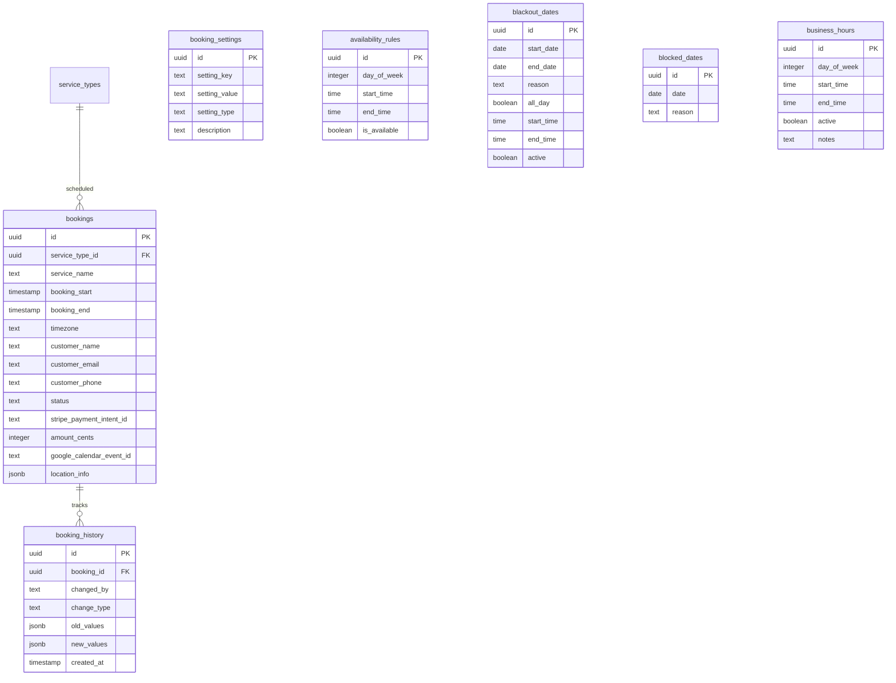
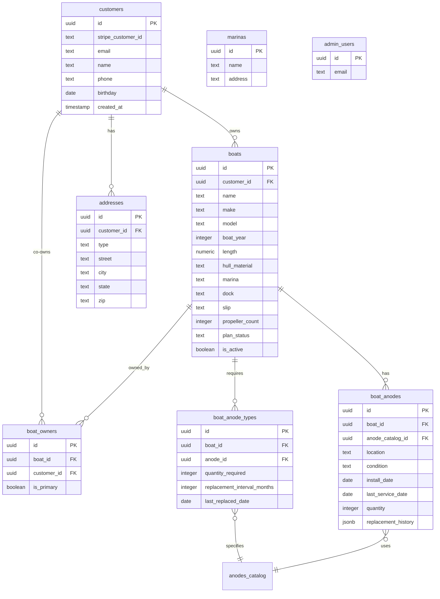

# Sailorskills Suite - Database Schema ERD

**Created:** 2025-10-28
**Last Updated:** 2025-10-28
**Database:** Supabase PostgreSQL (fzygakldvvzxmahkdylq)
**Total Objects:** 54 tables + 4 views = 58 database objects

---

## Table of Contents

1. [Core Business Flow ERD](#core-business-flow-erd)
2. [Complete Schema by Service](#complete-schema-by-service)
3. [Shared Tables Detail](#shared-tables-detail)
4. [Foreign Key Relationships](#foreign-key-relationships)
5. [Views and Computed Tables](#views-and-computed-tables)

---

## Core Business Flow ERD

This diagram shows the primary tables involved in the core business flow: customer acquisition → service delivery → billing → customer portal.



---

## Complete Schema by Service

### Estimator-Owned Tables (3 tables)



### Operations-Owned Tables (10 tables)



### Billing-Owned Tables (5 tables)



### Inventory-Owned Tables (14 tables)



### Portal-Owned Tables (5 tables)



### Booking-Owned Tables (7 tables)



### Shared Core Tables



---

## Shared Tables Detail

These 12 tables require cross-service coordination for schema changes (see TABLE_OWNERSHIP_MATRIX.md for coordination process).

| Table | Primary Owner | Writers | Key Relationships |
|-------|---------------|---------|-------------------|
| `customers` | Estimator | Estimator, Portal, Billing | → boats, addresses, service_orders, invoices |
| `boats` | Estimator | Estimator, Operations | → customers, service_logs, boat_anodes |
| `boat_owners` | Estimator | Estimator, Portal | → boats, customers |
| `boat_anodes` | Operations | Operations, Inventory | → boats, anodes_catalog |
| `boat_anode_types` | Operations | Operations, Inventory | → boats, anodes_catalog |
| `service_orders` | Estimator | Estimator, Operations | → customers, boats, service_logs |
| `service_logs` | Operations | Operations, Billing | → boats, service_orders, invoices |
| `service_requests` | Portal | Portal, Operations | → customer_accounts, boats |
| `addresses` | Estimator | Estimator, Portal | → customers |
| `marinas` | Estimator | Estimator, Operations | → (referenced by boats) |
| `customer_messages` | Portal | Portal, Operations | → customer_accounts, boats |
| `replenishment_list` | Inventory | Inventory, Operations | → anodes_catalog, inventory_items |
| `youtube_playlists` | Video | Operations, Video | → boats |

---

## Foreign Key Relationships

### Primary Keys
All tables use `uuid id` as primary key (generated by Supabase).

### Key Foreign Keys

**Customer → Boats:**
- `boats.customer_id` → `customers.id`
- `boat_owners.customer_id` → `customers.id`
- `boat_owners.boat_id` → `boats.id`

**Customer → Orders:**
- `service_orders.customer_id` → `customers.id`
- `service_orders.boat_id` → `boats.id`

**Orders → Service Logs:**
- `service_logs.boat_id` → `boats.id`
- `service_logs.service_id` → `service_orders.id` (optional)

**Service Logs → Invoices (Bi-directional):**
- `invoices.service_id` → `service_logs.id`
- `service_logs.invoice_id` → `invoices.id` (added migration 015)

**Invoices → Payments:**
- `payments.invoice_id` → `invoices.id`
- `invoice_line_items.invoice_id` → `invoices.id`

**Portal → Boats:**
- `customer_boat_access.customer_account_id` → `customer_accounts.id`
- `customer_boat_access.boat_id` → `boats.id`

**Inventory:**
- `anode_inventory.anode_id` → `anodes_catalog.id`
- `boat_anodes.anode_catalog_id` → `anodes_catalog.id`
- `inventory_transactions.anode_id` → `anodes_catalog.id`
- `inventory_transactions.item_id` → `inventory_items.id`

**Booking:**
- `bookings.service_type_id` → `service_types.id`
- `booking_history.booking_id` → `bookings.id`

---

## Views and Computed Tables

### Read-Only Views

```mermaid
erDiagram
    transaction_details {
        view "Joins invoices + payments + service_logs"
        uuid invoice_id
        text invoice_number
        uuid service_log_id
        uuid payment_id
        text customer_id
        uuid boat_id
        numeric amount
        text invoice_status
        text payment_status
        timestamp issued_at
        timestamp paid_at
    }

    inventory_value_report {
        view "Current inventory value by item"
        text item_type
        varchar name
        varchar sku
        integer quantity_on_hand
        numeric unit_cost
        numeric total_value
    }

    all_items_needing_reorder {
        view "Items below reorder point"
        text item_type
        uuid item_id
        varchar name
        varchar sku
        integer quantity_available
        integer reorder_point
        integer reorder_quantity
        numeric estimated_cost
    }

    v_boat_anodes_with_stock {
        view "Boat anodes with catalog + stock info"
        uuid id
        uuid boat_id
        text location
        text condition
        varchar catalog_name
        varchar catalog_sku
        numeric catalog_price
        integer stock_available
        text service_status
    }
```

### View Purposes

- **transaction_details:** Optimized for Portal transaction page (invoices + payments + service logs in one query)
- **inventory_value_report:** Dashboard reporting (total inventory value)
- **all_items_needing_reorder:** Inventory management (items to reorder)
- **v_boat_anodes_with_stock:** Operations packing lists (anodes needed + stock availability)

---

## Schema Statistics

- **Total Tables:** 54
- **Total Views:** 4
- **Foreign Keys:** ~45 relationships
- **Shared Tables (Multiple Writers):** 12 (22%)
- **Single-Owner Tables:** 42 (78%)

### Tables by Service

| Service | Table Count | Shared Tables |
|---------|-------------|---------------|
| Estimator | 3 | 3 (customers, boats, service_orders) |
| Operations | 10 | 5 (boats, service_logs, boat_anodes, boat_anode_types, youtube_playlists) |
| Billing | 5 | 1 (service_logs) |
| Inventory | 14 | 3 (boat_anodes, boat_anode_types, replenishment_list) |
| Portal | 5 | 3 (addresses, customer_messages, service_requests) |
| Booking | 7 | 0 |
| Video | 1 | 1 (youtube_playlists) |
| Dashboard | 0 (read-only) | 0 |

---

## Related Documentation

- [TABLE_OWNERSHIP_MATRIX.md](../../TABLE_OWNERSHIP_MATRIX.md) - Detailed ownership rules
- [MIGRATION_SUMMARY.md](../../MIGRATION_SUMMARY.md) - Schema change history
- [service-relationship-diagram.md](./service-relationship-diagram.md) - Service data flow

---

**Document Version:** 1.0
**Created:** 2025-10-28
**Last Updated:** 2025-10-28
**Next Review:** After major schema changes
