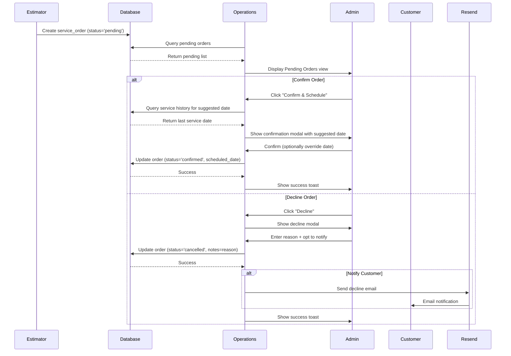

# Pending Orders Queue - Design Document

**Date:** 2025-10-28
**Feature:** Task 4.1 - Complete Pending Orders Queue
**Priority:** HIGH (Critical workflow gap)
**Estimated Effort:** 8-12 hours

---

## Problem Statement

Currently, orders from the Estimator go directly to the calendar without a confirmation step. There's no dedicated view for incoming orders that need admin review and scheduling. This creates workflow gaps where orders can be missed or overlooked.

---

## Requirements Summary

### Functional Requirements
1. **Dedicated Orders View**: New top-level navigation item for order management
2. **Pending Orders List**: Display all orders with status='pending' with comprehensive information
3. **Order Confirmation**: Admin can confirm orders with auto-scheduling (overridable)
4. **Order Decline**: Admin can decline with mandatory reason + optional customer notification
5. **Filtering**: Filter by service type
6. **Sorting**: Default sort by order date (oldest first)
7. **Visual Priority**: Show estimated amount + highlight orders older than threshold
8. **Customer Contact**: Quick link to contact customer about their order

### Success Criteria
- ✅ Operations has functional order intake workflow
- ✅ Orders flow: Estimator → Pending → Confirmed → Scheduled
- ✅ No orders missed or lost in the system
- ✅ Clear visibility into pending workload
- ✅ Efficient batch processing of similar service types

---

## Architecture Overview

### Data Model

**Existing `service_orders` table** (no schema changes needed):
```sql
- id: uuid (PK)
- order_number: text (unique)
- customer_id: uuid (FK → customers)
- boat_id: uuid (FK → boats)
- service_type: text
- service_interval: text
- estimated_amount: numeric(10,2)
- status: text ('pending', 'confirmed', 'in_progress', 'completed', 'cancelled')
- scheduled_date: date
- created_at: timestamp
- service_details: jsonb
- metadata: jsonb
- notes: text
```

**Status Flow:**
```
Estimator creates order
        ↓
    [pending] ← Initial state, appears in Pending Orders Queue
        ↓
Admin reviews in Operations
        ↓
    ┌─────────────┬─────────────┐
    ↓             ↓             ↓
[confirmed]  [cancelled]  [pending] (defer decision)
    ↓
Auto-set scheduled_date (overridable)
    ↓
[in_progress] → Service started
    ↓
[completed] → Service finished
```

### UI Components

#### 1. Navigation Addition
**Location:** Main navigation bar
**Component:** New "Orders" nav item
**Badge:** Show count of pending orders (real-time)

```javascript
// src/navigation.js addition
{
  id: 'orders',
  label: 'Orders',
  icon: '📋',
  badgeCount: async () => {
    const { count } = await supabase
      .from('service_orders')
      .select('*', { count: 'exact', head: true })
      .eq('status', 'pending');
    return count;
  }
}
```

#### 2. Pending Orders View
**File:** `src/views/orders.js`
**HTML Container:** `<div id="orders-view">`

**Features:**
- Filter tabs by service type (All, Cleaning & Anodes, Inspection, etc.)
- Sort controls (Date, Amount, Customer)
- Order cards with all details
- Action buttons per order

**Order Card Structure:**
```html
<div class="order-card" data-order-id="{id}" data-age-days="{days}">
  <div class="order-header">
    <span class="order-number">{order_number}</span>
    <span class="order-age-badge" *if days > 3>⚠️ {days} days old</span>
    <span class="order-amount">${estimated_amount}</span>
  </div>

  <div class="order-details">
    <div class="customer-info">
      <strong>{customer_name}</strong>
      <span>{boat_name}</span>
    </div>
    <div class="service-info">
      <span class="service-type-badge">{service_type}</span>
      <span class="service-interval">{service_interval}</span>
    </div>
    <div class="order-meta">
      <span>Ordered: {created_at}</span>
      <span>Location: {marina} - {dock} {slip}</span>
    </div>
  </div>

  <div class="order-actions">
    <button class="btn-confirm" onclick="confirmOrder('{id}')">
      ✓ Confirm & Schedule
    </button>
    <button class="btn-decline" onclick="declineOrder('{id}')">
      ✗ Decline
    </button>
    <button class="btn-contact" onclick="contactCustomer('{customer_id}')">
      💬 Contact Customer
    </button>
  </div>
</div>
```

#### 3. Confirm Order Modal
**Triggered by:** Click "Confirm & Schedule" button
**Component:** `src/components/confirm-order-modal.js`

**Flow:**
1. Calculate suggested scheduled_date based on:
   - Customer's service_interval
   - Last service date (if exists)
   - Next available slot
2. Display suggested date with calendar picker for override
3. Show service summary for review
4. Confirm updates order: status='confirmed', scheduled_date=selected_date

**Implementation:**
```javascript
async function calculateSuggestedDate(order) {
  // Get customer's service interval from order or boat
  const interval = order.service_interval; // e.g., "1-month", "2-month"

  // Get last service for this boat
  const { data: lastService } = await supabase
    .from('service_logs')
    .select('service_date')
    .eq('boat_id', order.boat_id)
    .order('service_date', { ascending: false })
    .limit(1)
    .single();

  // Calculate next date
  let suggestedDate;
  if (lastService) {
    const lastDate = new Date(lastService.service_date);
    const intervalMonths = parseInt(interval); // Extract number from "1-month"
    suggestedDate = new Date(lastDate);
    suggestedDate.setMonth(suggestedDate.getMonth() + intervalMonths);
  } else {
    // No previous service, suggest "soon" (e.g., within next week)
    suggestedDate = new Date();
    suggestedDate.setDate(suggestedDate.getDate() + 7);
  }

  return suggestedDate.toISOString().split('T')[0];
}
```

#### 4. Decline Order Modal
**Triggered by:** Click "Decline" button
**Component:** `src/components/decline-order-modal.js`

**Form Fields:**
- Decline reason (textarea, required)
- Notify customer (checkbox, default=true)
- Email message preview (if notify=true)

**Flow:**
1. Admin enters decline reason
2. If notify customer:
   - Show email preview with reason
   - Admin can edit message
3. Confirm decline:
   - Update order: status='cancelled'
   - Store reason in notes or metadata
   - Send email via Resend (if notify=true)

**Email Template:**
```
Subject: Update on Your Service Request

Hi {customer_name},

Thank you for requesting service through Sailor Skills.

Unfortunately, we're unable to accommodate your service request at this time.

Reason: {decline_reason}

If you have questions or would like to discuss alternative options, please reply to this email or call us at {phone}.

Best regards,
Sailor Skills Team
```

### Data Flow



---

## Implementation Plan

### Phase 1: UI Foundation (2-3 hours)
1. Add "Orders" navigation item with badge count
2. Create orders.html view (or add to index.html as #orders-view)
3. Create src/views/orders.js with loadOrders() function
4. Implement basic pending orders query and list display
5. Add filter tabs for service types

**Files to create/modify:**
- `src/navigation.js` - Add Orders nav item
- `src/views/orders.js` - New file for orders view
- `index.html` - Add #orders-view container (if not separate page)
- `styles/orders.css` - Order card styling

### Phase 2: Order Actions (3-4 hours)
1. Create confirm-order-modal component
2. Implement calculateSuggestedDate() logic
3. Create decline-order-modal component
4. Implement decline reason capture + validation
5. Wire up action buttons to modals

**Files to create/modify:**
- `src/components/confirm-order-modal.js` - New file
- `src/components/decline-order-modal.js` - New file
- `src/views/orders.js` - Add action handlers

### Phase 3: Email Integration (1-2 hours)
1. Check if Resend email service exists in suite
2. Create email template for order decline
3. Implement sendDeclineNotification() function
4. Add email preview to decline modal
5. Test email sending (use test mode initially)

**Files to create/modify:**
- `src/services/email-service.js` - Email integration (if not exists)
- Or use existing shared email utilities
- `src/templates/decline-email.js` - Email template

### Phase 4: Filtering & Sorting (1-2 hours)
1. Implement service type filtering
2. Implement sort by date/amount
3. Add age highlighting logic (>3 days threshold)
4. Add order count statistics (total pending, by type, avg age)

**Files to modify:**
- `src/views/orders.js` - Add filtering/sorting logic

### Phase 5: Testing & Polish (1-2 hours)
1. Test with Playwright MCP:
   - Create test order in Estimator
   - Verify appears in pending orders
   - Test confirm workflow
   - Test decline workflow with/without notification
   - Verify status transitions
2. Test edge cases:
   - Orders with no previous service history
   - Orders with missing boat/customer data
   - Filter/sort combinations
3. UI polish:
   - Loading states
   - Error handling
   - Success toasts
   - Responsive design

---

## Database Queries

### Load Pending Orders
```sql
SELECT
  o.*,
  c.name as customer_name,
  c.email as customer_email,
  c.phone as customer_phone,
  b.name as boat_name,
  b.boat_year,
  b.make,
  b.model,
  m.name as marina_name,
  EXTRACT(DAY FROM (CURRENT_DATE - o.created_at::date)) as age_days
FROM service_orders o
LEFT JOIN customers c ON o.customer_id = c.id
LEFT JOIN boats b ON o.boat_id = b.id
LEFT JOIN marinas m ON o.marina_id = m.id
WHERE o.status = 'pending'
ORDER BY o.created_at ASC;
```

### Get Order Count by Service Type
```sql
SELECT
  service_type,
  COUNT(*) as count
FROM service_orders
WHERE status = 'pending'
GROUP BY service_type
ORDER BY count DESC;
```

### Calculate Suggested Date
```sql
-- Get last service date for boat
SELECT service_date
FROM service_logs
WHERE boat_id = $1
ORDER BY service_date DESC
LIMIT 1;

-- If no service logs, check service_orders
SELECT scheduled_date
FROM service_orders
WHERE boat_id = $1 AND status = 'completed'
ORDER BY scheduled_date DESC
LIMIT 1;
```

---

## Edge Cases & Error Handling

### Missing Customer/Boat Data
**Scenario:** Order has customer_id/boat_id but lookup returns null
**Handling:**
- Display order with "(Unknown Customer)" placeholder
- Show warning icon
- Provide "Fix Data" action to correct references
- Log error for admin review

### Concurrent Order Actions
**Scenario:** Two admins try to confirm/decline same order simultaneously
**Handling:**
- Use optimistic locking or version checking
- Show error if order status changed: "Order already processed by another admin"
- Refresh view automatically

### Email Send Failure
**Scenario:** Decline notification fails to send
**Handling:**
- Still mark order as declined (primary action succeeds)
- Log email failure
- Show warning toast: "Order declined but email notification failed"
- Add to retry queue or manual follow-up list

### Auto-Schedule Calculation Failure
**Scenario:** Cannot determine suggested date (missing data, invalid interval)
**Handling:**
- Fall back to "1 week from now" default
- Show warning in modal: "Unable to calculate based on service history"
- Allow admin to pick any date

### Orders Without Boats
**Scenario:** Order created without boat_id (possible from Estimator if new customer)
**Handling:**
- Display in pending orders with "No Boat Assigned" indicator
- Provide "Assign Boat" action
- Allow confirming after boat assignment

---

## Testing Checklist

### Unit Tests (if applicable)
- [ ] calculateSuggestedDate() with various intervals
- [ ] calculateSuggestedDate() with no service history
- [ ] Age calculation (days since created)
- [ ] Filter logic for service types
- [ ] Sort logic for date/amount

### Integration Tests
- [ ] Create order in Estimator → appears in Operations pending queue
- [ ] Confirm order → status changes to 'confirmed', scheduled_date set
- [ ] Decline order → status changes to 'cancelled', reason stored
- [ ] Decline with notification → email sent via Resend
- [ ] Filter by service type → only matching orders shown
- [ ] Sort by date → oldest first
- [ ] Orders >3 days old → highlighted badge shown
- [ ] Navigation badge → shows correct pending count

### UI/UX Tests (Playwright)
- [ ] Orders view loads without errors
- [ ] Order cards display all information correctly
- [ ] Confirm modal opens with suggested date
- [ ] Date picker allows override
- [ ] Confirm success → toast shown, order removed from list
- [ ] Decline modal requires reason
- [ ] Decline with notification → preview shown
- [ ] Decline success → toast shown, order removed from list
- [ ] Contact customer → opens appropriate messaging interface
- [ ] Mobile responsive design

---

## Follow-Up Enhancements (Future)

### Phase 2 Features (Not in Initial Implementation)
1. **Bulk Actions**: Select multiple orders, confirm/decline batch
2. **Order Assignment**: Assign orders to specific technicians
3. **Calendar Integration**: Visual calendar view of confirmed orders
4. **Order Templates**: Pre-fill order details for repeat customers
5. **Analytics**: Track order confirmation rate, avg time to confirm, decline reasons
6. **Customer Portal View**: Let customers see order status
7. **SMS Notifications**: Alternative to email for decline notifications
8. **Order Notes/Comments**: Internal notes on orders before confirming
9. **Order Priority**: Flag urgent orders, high-value customers
10. **Integration with Booking**: Link to sailorskills-booking for training services

---

## Dependencies

### External Services
- **Resend**: Email service for decline notifications (check if already integrated)
- **Supabase**: Database queries (already integrated)

### Internal Services
- **sailorskills-estimator**: Creates orders (already done)
- **sailorskills-booking**: May create orders for training (if applicable)
- **sailorskills-operations**: Displays/manages orders (this feature)

### Shared Components
- Modal component (already exists in Operations)
- Toast notifications (already exists in Operations)
- Date picker (may need to add if not present)

---

## Rollout Plan

### Step 1: Develop & Test Locally
- Implement all phases on local development
- Test with real/sample data
- Verify all workflows end-to-end

### Step 2: Deploy to Preview
- Deploy to Vercel preview URL
- Share with team for UAT (User Acceptance Testing)
- Gather feedback on UX/flow

### Step 3: Production Deployment
- Merge to main → auto-deploy to production
- Monitor for errors in first 24 hours
- Gather admin team feedback

### Step 4: Training & Documentation
- Create quick-start guide for admin team
- Document common workflows
- Add to Operations CLAUDE.md

---

## Success Metrics (Post-Launch)

Track these metrics after feature launch:

1. **Order Processing Time**: Avg time from order creation to confirmation
2. **Order Decline Rate**: % of orders declined vs confirmed
3. **Aged Orders**: Number of orders pending > 3 days (should trend to zero)
4. **Missed Orders**: Orders that never get confirmed/declined (should be zero)
5. **Email Notification Success Rate**: % of decline emails successfully sent

**Target Metrics:**
- Avg processing time: < 24 hours
- Aged orders (>3 days): 0
- Missed orders: 0

---

## Notes & Considerations

### Design System Compliance
- Use shared CSS variables from `/shared/src/ui/design-tokens.css`
- Follow sharp corners design (no border-radius)
- Use Montserrat font
- Consistent button styling with rest of Operations

### Performance
- Pending orders list should load in <1 second
- Consider pagination if pending orders exceed 50 (unlikely but plan for scale)
- Cache order count for badge (refresh every 30 seconds)

### Security
- Verify admin authentication before displaying Orders view
- Check admin permissions for confirm/decline actions
- Validate all inputs (decline reason, scheduled date)
- Prevent SQL injection (use parameterized queries)

### Accessibility
- Keyboard navigation for all actions
- Screen reader labels for action buttons
- Clear focus indicators
- Alt text for status badges/icons

---

## Appendix: Related Documents

- PROJECT_STABILIZATION_PLAN.md - Phase 4, Task 4.1
- ROADMAP.md - Q4 2025 priorities
- sailorskills-operations/CLAUDE.md - Operations service overview
- TABLE_OWNERSHIP_MATRIX.md - service_orders table ownership

---

**Document Status:** Ready for Implementation
**Next Steps:** Create git worktree → Generate implementation plan → Begin Phase 1
