# Sailorskills Suite - Edge Functions & Webhook Map

**Created:** 2025-10-28
**Last Updated:** 2025-10-28
**Purpose:** Document all Supabase edge functions, webhooks, and external API integrations

---

## Table of Contents

1. [Architecture Overview](#architecture-overview)
2. [Supabase Edge Functions](#supabase-edge-functions)
3. [Webhook Endpoints](#webhook-endpoints)
4. [External API Calls](#external-api-calls)
5. [Request/Response Flows](#requestresponse-flows)
6. [Security & Authentication](#security--authentication)

---

## Architecture Overview

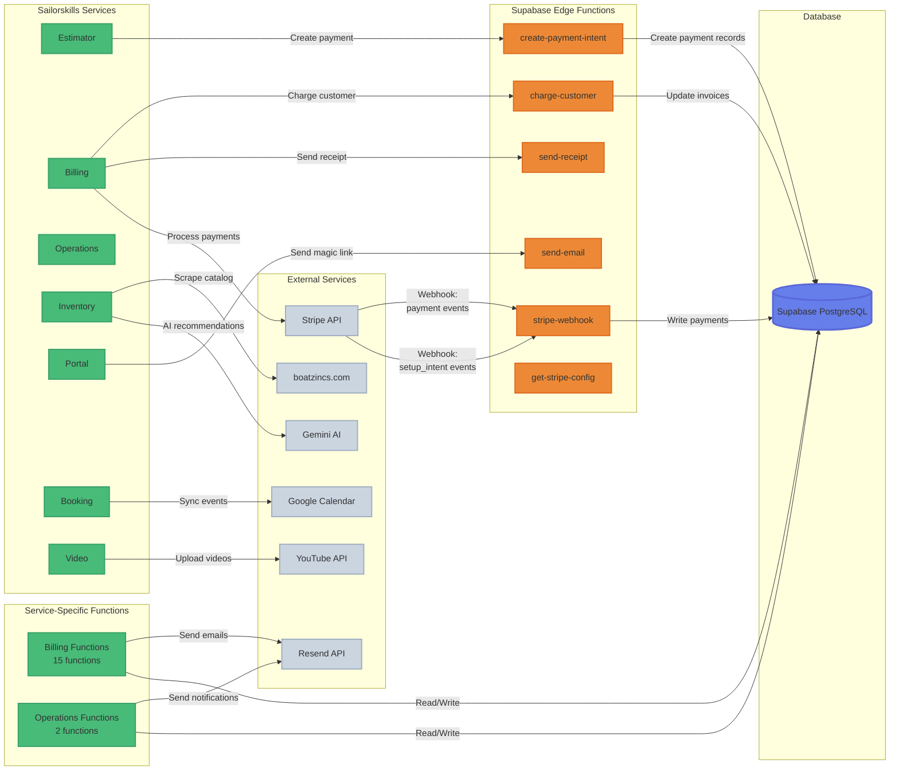

---

## Supabase Edge Functions

### Shared Edge Functions (sailorskills-shared)

These edge functions are used across multiple services.

| Function | URL | Purpose | Used By | Method |
|----------|-----|---------|---------|--------|
| `stripe-webhook` | `/functions/v1/stripe-webhook` | Handle Stripe webhooks (payment_intent.succeeded, setup_intent.succeeded) | Billing, Estimator | POST |
| `create-payment-intent` | `/functions/v1/create-payment-intent` | Create Stripe PaymentIntent for one-time payments | Estimator, Billing | POST |
| `charge-for-service` | `/functions/v1/charge-for-service` | Charge saved payment method for service completion | Billing, Estimator | POST |
| `get-stripe-config` | `/functions/v1/get-stripe-config` | Return Stripe publishable key | Estimator, Billing | GET |
| `send-receipt` | `/functions/v1/send-receipt` | Send payment receipt email via Resend | Billing, Dashboard | POST |

### Billing Edge Functions (sailorskills-billing)

Service-specific functions for Billing/Completion service.

| Function | Path | Purpose | Triggers |
|----------|------|---------|----------|
| `customer-details` | `/functions/v1/customer-details` | Fetch customer and boat details | UI: Customer profile page |
| `boats` | `/functions/v1/boats` | Fetch boat list | UI: Boat selector |
| `boat-anodes` | `/functions/v1/boat-anodes` | Get anode configurations for boat | UI: Anode tracking |
| `customer-services` | `/functions/v1/customer-services` | Get customer service subscriptions | UI: Service management |
| `service-logs` | `/functions/v1/service-logs` | Fetch/create service logs | UI: Service documentation |
| `save-service-log` | `/functions/v1/save-service-log` | Save service log with conditions | UI: Save button |
| `save-conditions` | `/functions/v1/save-conditions` | Save boat conditions (legacy) | UI: Condition form |
| `invoices` | `/functions/v1/invoices` | Fetch/create invoices | UI: Invoice management |
| `charge-customer` | `/functions/v1/charge-customer` | Process payment for service | UI: Charge button |
| `stripe-customers` | `/functions/v1/stripe-customers` | Manage Stripe customer records | UI: Customer sync |
| `search-customers-with-boats` | `/functions/v1/search-customers-with-boats` | Search customers and boats | UI: Search bar |
| `send-email` | `/functions/v1/send-email` | Send custom email via Resend | UI: Email button |
| `send-receipt` | `/functions/v1/send-receipt` | Send payment receipt email | UI: After payment |
| `anode-inventory-status` | `/functions/v1/anode-inventory-status` | Check anode stock levels | UI: Inventory widget |
| `finalize-service-inventory` | `/functions/v1/finalize-service-inventory` | Update inventory after service | UI: Service completion |

### Operations Edge Functions (sailorskills-operations)

| Function | Path | Purpose | Triggers |
|----------|------|---------|----------|
| `get-playlist-videos` | `/functions/v1/get-playlist-videos` | Fetch YouTube playlist videos | UI: Video widget |
| `send-notification` | `/functions/v1/send-notification` | Send notification via Resend | UI: Notification trigger |

### Dashboard Edge Functions (sailorskills-dashboard)

| Function | Path | Purpose | Triggers |
|----------|------|---------|----------|
| `send-receipt` | `/functions/v1/send-receipt` | Send payment receipt (duplicate of shared) | UI: Receipt resend |

---

## Webhook Endpoints

### Stripe Webhooks → Supabase

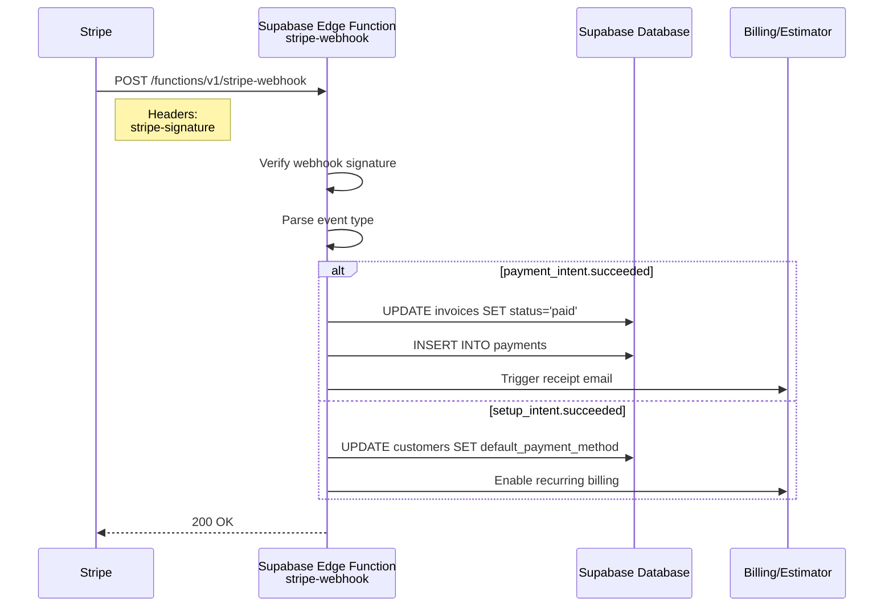

**Webhook Configuration:**

| Webhook | URL | Events | Signing Secret |
|---------|-----|--------|----------------|
| Stripe → Supabase | `https://fzygakldvvzxmahkdylq.supabase.co/functions/v1/stripe-webhook` | `payment_intent.succeeded`<br/>`setup_intent.succeeded` | `STRIPE_WEBHOOK_SECRET` (Supabase secret) |

**Event Handlers:**

1. **`payment_intent.succeeded`** - One-time payment completed
   - Updates `invoices.status` = 'paid'
   - Creates `payments` record
   - Triggers receipt email via Resend

2. **`setup_intent.succeeded`** - Payment method saved for recurring billing
   - Attaches payment method to Stripe customer
   - Sets payment method as default
   - Enables recurring service billing

### Internal Webhooks (Service → Service)

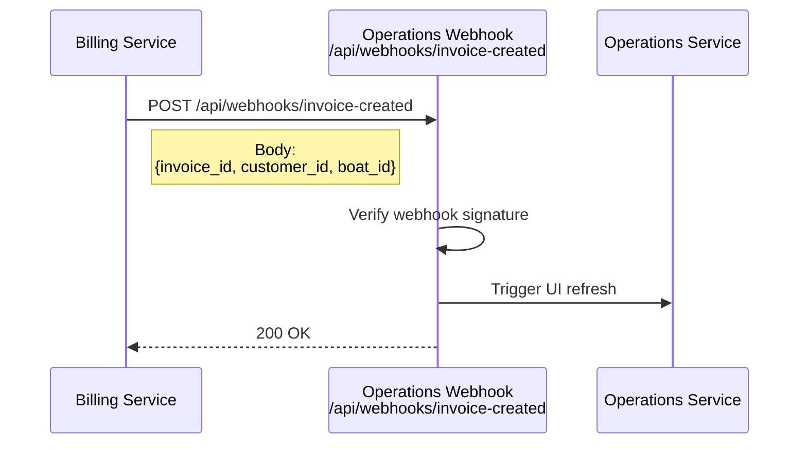

**Internal Webhook:**

| Source | Destination | URL | Purpose | Status |
|--------|-------------|-----|---------|--------|
| Billing | Operations | `/api/webhooks/invoice-created` | Notify Operations when invoice created | ⚠️ TODO: Implement signature verification |

---

## External API Calls

### Stripe API (Payment Processing)

**Used By:** Estimator, Billing

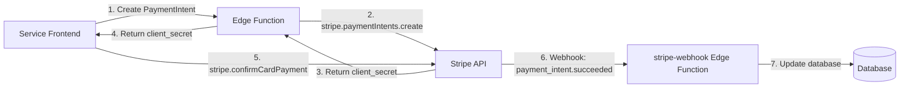

**Key Operations:**

| Operation | Edge Function | Stripe API Method | Purpose |
|-----------|---------------|-------------------|---------|
| Create PaymentIntent | `create-payment-intent` | `stripe.paymentIntents.create()` | One-time payment |
| Create SetupIntent | `charge-for-service` | `stripe.setupIntents.create()` | Save payment method |
| Charge Saved Method | `charge-customer` | `stripe.paymentIntents.create({payment_method, confirm: true})` | Recurring billing |
| Get Customer | `stripe-customers` | `stripe.customers.retrieve()` | Fetch customer details |
| List Payment Methods | `stripe-customers` | `stripe.paymentMethods.list()` | Show saved cards |

**Rate Limits:**
- Test mode: 100 requests/second
- Live mode: 1,000 requests/second

### Resend API (Email Service)

**Used By:** Billing, Portal, Operations, Booking

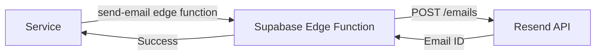

**Email Types:**

| Type | Template | Used By | Trigger |
|------|----------|---------|---------|
| Payment Receipt | `payment-receipt.html` | Billing | After `payment_intent.succeeded` |
| Invoice | `invoice.html` | Billing | Invoice created |
| Magic Link | Built-in | Portal | Customer login |
| Service Notification | `service-complete.html` | Operations | Service completed |
| Booking Confirmation | `booking-confirm.html` | Booking | Booking created |

**Rate Limits:**
- Free tier: 100 emails/day
- Pro tier: 50,000 emails/month

**API Endpoint:**
```
POST https://api.resend.com/emails
Authorization: Bearer re_...
```

### YouTube API (Video Management)

**Used By:** Video, Operations

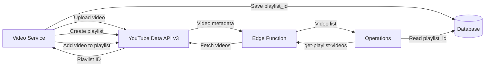

**Key Operations:**

| Operation | API Endpoint | Purpose | Quota Cost |
|-----------|--------------|---------|------------|
| Upload video | `videos.insert` | Upload service video | 1600 units |
| Create playlist | `playlists.insert` | Create boat playlist | 50 units |
| Add to playlist | `playlistItems.insert` | Link video to playlist | 50 units |
| List playlist videos | `playlistItems.list` | Display videos in Operations | 1 unit |

**Quota:** 10,000 units/day (sufficient for current volume)

### Google Calendar API (Booking)

**Used By:** Booking

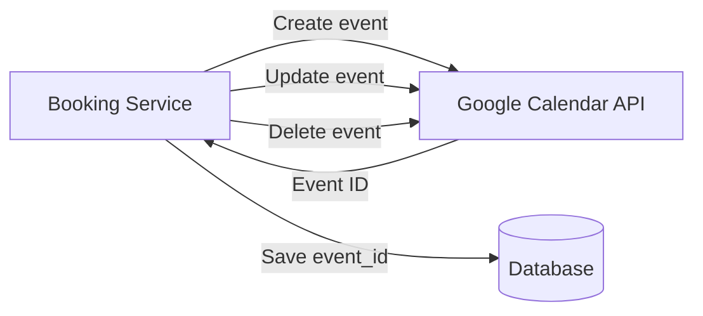

**Key Operations:**

| Operation | API Endpoint | Purpose | Rate Limit |
|-----------|--------------|---------|------------|
| Create event | `events.insert` | Create training booking | 1,000/day/user |
| Update event | `events.update` | Reschedule booking | 1,000/day/user |
| Delete event | `events.delete` | Cancel booking | 1,000/day/user |
| List events | `events.list` | Sync calendar | 1,000/day/user |

### Gemini AI API (Inventory Intelligence)

**Used By:** Inventory

**Status:** 🟡 Planned (not yet implemented)

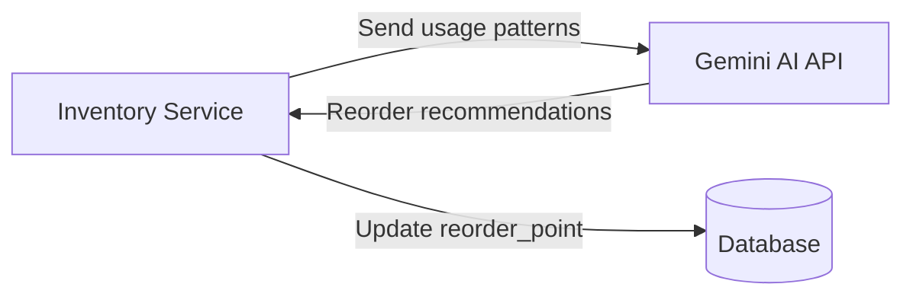

**Planned Use Cases:**
- Optimize reorder points based on usage patterns
- Predict seasonal demand
- Suggest bulk purchase opportunities

### boatzincs.com (Anode Catalog Scraping)

**Used By:** Inventory

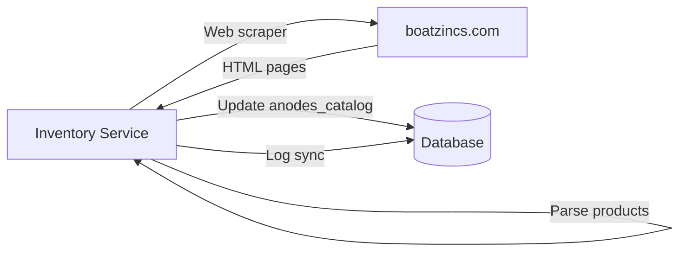

**Scraper Details:**
- **Frequency:** Daily (or on-demand)
- **Method:** HTTP GET (respectful 1 req/sec rate limit)
- **Parsing:** Cheerio/Puppeteer for product extraction
- **Tables Updated:** `anodes_catalog`, `anode_price_history`, `anode_sync_logs`

---

## Request/Response Flows

### Payment Flow (Estimator → Stripe → Billing)

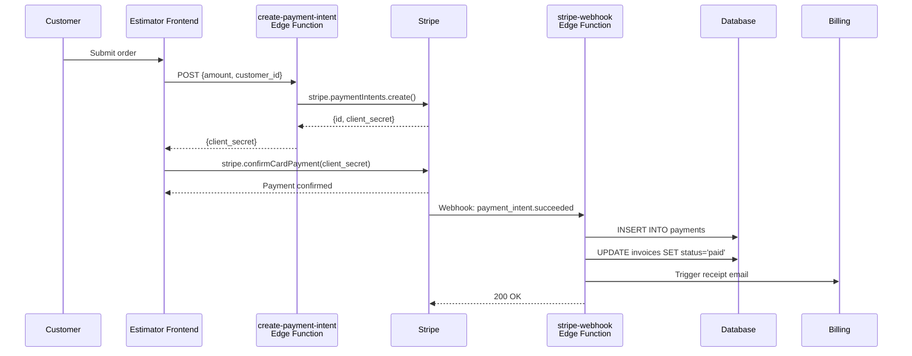

### Service Completion Flow (Operations → Billing → Customer)

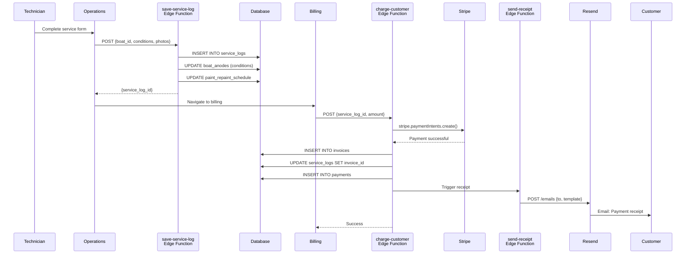

---

## Security & Authentication

### Edge Function Authentication

**Supabase Auth:**
- All edge functions use Supabase Auth headers
- `Authorization: Bearer <supabase_anon_key>` for client calls
- `Authorization: Bearer <user_jwt_token>` for authenticated calls
- RLS policies enforce row-level security

**API Keys:**
```env
# Supabase (client-side)
VITE_SUPABASE_URL=https://fzygakldvvzxmahkdylq.supabase.co
VITE_SUPABASE_ANON_KEY=eyJ... (public, safe to expose)

# Stripe (server-side only, stored in Supabase secrets)
STRIPE_SECRET_KEY=sk_test_... / sk_live_...
STRIPE_WEBHOOK_SECRET=whsec_...

# Resend (server-side only)
RESEND_API_KEY=re_...

# YouTube (server-side only)
YOUTUBE_API_KEY=AIza...

# Google Calendar (server-side only)
GOOGLE_CALENDAR_CREDENTIALS={...}
```

### Webhook Security

**Stripe Webhook Verification:**
```javascript
// Verify signature before processing
const sig = request.headers.get('stripe-signature');
const event = stripe.webhooks.constructEvent(
  requestBody,
  sig,
  process.env.STRIPE_WEBHOOK_SECRET
);
```

**Internal Webhook Security:**
```javascript
// TODO: Implement signature verification for internal webhooks
const secret = request.headers.get('x-webhook-secret');
// Verify secret matches expected value
```

### Rate Limiting

**Edge Functions:**
- Supabase: 500 requests/second per project
- Custom rate limiting: Not implemented (relies on Supabase defaults)

**External APIs:**
- **Stripe:** 100-1,000 req/sec (no concerns at current volume)
- **Resend:** 100 emails/day free tier (may need upgrade)
- **YouTube:** 10,000 quota units/day (sufficient)
- **Google Calendar:** 1,000 req/day/user (sufficient)

---

## Monitoring & Logging

### Edge Function Logs

**Access Logs:**
```bash
# View Supabase edge function logs
supabase functions logs stripe-webhook --project-ref fzygakldvvzxmahkdylq

# Real-time logs
supabase functions logs --follow
```

**Log Locations:**
- Supabase Dashboard → Edge Functions → Logs
- Vercel → Deployments → Function Logs (for service API routes)

### Webhook Monitoring

**Stripe Webhook Logs:**
- Stripe Dashboard → Developers → Webhooks → Event logs
- Shows delivery status, response codes, retry attempts

**Recommended Monitoring:**
- ✅ Stripe webhooks: Monitor in Stripe Dashboard
- ⚠️ Internal webhooks: Add logging/monitoring (TODO)
- ⚠️ External API calls: Add error tracking (TODO)

---

## Related Documentation

- [INTEGRATIONS.md](../../INTEGRATIONS.md) - Detailed API credentials and setup
- [service-relationship-diagram.md](./service-relationship-diagram.md) - Service data flow
- [database-schema-erd.md](./database-schema-erd.md) - Database schema

---

**Document Version:** 1.0
**Created:** 2025-10-28
**Last Updated:** 2025-10-28
**Next Review:** After adding new edge functions or webhooks
