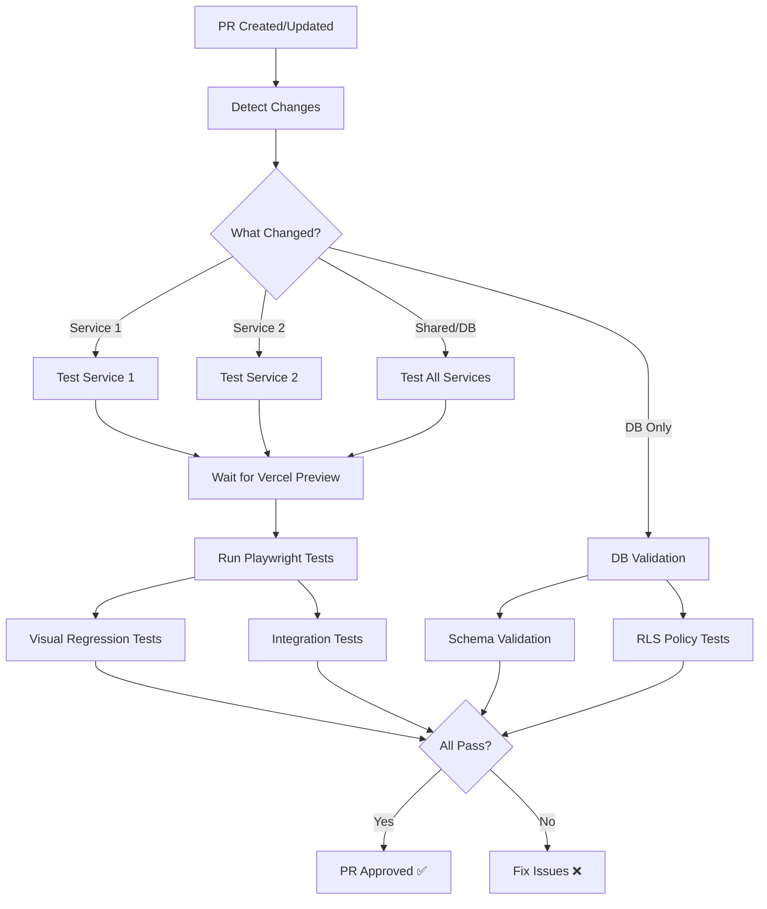

# CI/CD Setup Guide

Step-by-step guide to setting up the GitHub Actions testing pipeline.

## Prerequisites

- GitHub repository
- Vercel project connected to repository
- Test database (Supabase or PostgreSQL)
- Node.js project with Playwright installed

## Step 1: Copy Workflow Files

```bash
# Copy GitHub Actions workflows to your repository
cp assets/github-workflows/test-pr.yml .github/workflows/
cp assets/github-workflows/smoke-tests.yml .github/workflows/
```

## Step 2: Configure GitHub Secrets

Add these secrets in GitHub repo settings → Secrets and variables → Actions:

```
TEST_DATABASE_URL           # Your test database connection string
VITE_SUPABASE_URL          # Test environment Supabase URL
VITE_SUPABASE_ANON_KEY     # Test environment anon key
PRODUCTION_URL              # Production URL for smoke tests (e.g., https://app.example.com)
```

### How to Add Secrets

1. Go to repository → Settings → Secrets and variables → Actions
2. Click "New repository secret"
3. Add each secret name and value
4. Click "Add secret"

## Step 3: Customize Workflow for Your Services

Edit `.github/workflows/test-pr.yml`:

```yaml
# Update the paths-filter to match your services
filters: |
  shared:
    - 'shared/**'              # Your shared package path
    - '**/shared/**'
  db:
    - '**/supabase/migrations/**'  # Your migration path
  service1:
    - 'your-service-name/**'   # Replace with actual service name
  service2:
    - 'another-service/**'     # Add more services as needed
```

## Step 4: Install Dependencies in Each Service

```bash
cd your-service-name/

# Install Playwright
npm install --save-dev @playwright/test

# Install Playwright browsers
npx playwright install chromium

# Create playwright.config.js
cp ../skills/testing-platform/assets/config-templates/playwright.config.js ./
```

## Step 5: Set Up Pre-Commit Hooks

```bash
cd your-service-name/

# Install Husky and lint-staged
npm install --save-dev husky lint-staged

# Initialize Husky
npx husky install

# Create pre-commit hook
mkdir -p .husky
cp ../skills/testing-platform/assets/config-templates/pre-commit .husky/

# Make it executable
chmod +x .husky/pre-commit

# Add lint-staged config to package.json
# (Copy from assets/config-templates/package.json-lint-staged)
```

## Step 6: Verify Vercel Integration

The workflow uses `patrickedqvist/wait-for-vercel-preview` action to wait for Vercel deployment.

**Requirements:**
- Vercel must be connected to your GitHub repository
- Vercel should auto-deploy PRs (default behavior)
- GITHUB_TOKEN is automatically available in Actions (no setup needed)

**Verify Vercel is set up:**
1. Open a test PR
2. Check that Vercel creates a preview deployment
3. Look for "View deployment" link in PR checks

## Step 7: Test the Workflow

```bash
# Create a test branch
git checkout -b test-ci-setup

# Make a small change
echo "# Test" >> README.md

# Commit and push
git add README.md
git commit -m "test: verify CI/CD pipeline"
git push origin test-ci-setup

# Create PR on GitHub
# Watch GitHub Actions run
```

## Step 8: Configure Service-Specific Tests

Each service should have its own test directory:

```
your-service/
├── tests/
│   ├── feature1.spec.js
│   ├── feature2.spec.js
│   ├── visual/
│   │   └── visual-regression.spec.js
│   └── helpers/
│       ├── db-utils.js
│       └── test-data.js
├── playwright.config.js
└── package.json
```

Copy test templates:

```bash
cp assets/playwright-templates/visual-regression.spec.js tests/visual/
cp assets/playwright-templates/integration.spec.js tests/
cp assets/playwright-templates/smoke.spec.js tests/smoke/
cp assets/test-helpers/*.js tests/helpers/
```

## Workflow Execution Flow



## Troubleshooting

### Tests Timeout Waiting for Vercel

**Problem:** Workflow fails with "Timeout waiting for Vercel deployment"

**Solution:**
1. Verify Vercel is connected to repository
2. Check Vercel deployment logs
3. Increase timeout in workflow:

```yaml
- name: Wait for Vercel Deployment
  uses: patrickedqvist/wait-for-vercel-preview@v1.2.0
  with:
    max_timeout: 600  # Increase to 10 minutes
```

### Database Connection Fails

**Problem:** Tests fail with "Connection refused" or "Invalid credentials"

**Solution:**
1. Verify TEST_DATABASE_URL secret is correct
2. Check database allows connections from GitHub Actions IPs
3. Test connection string locally:

```bash
psql "$TEST_DATABASE_URL" -c "SELECT 1"
```

### Tests Pass Locally, Fail in CI

**Problem:** Tests pass on your machine but fail in GitHub Actions

**Common causes:**
1. Environment variables missing in CI
2. Timing issues (network slower in CI)
3. Different Node.js/browser versions

**Solutions:**
```javascript
// Increase timeouts for CI
test.setTimeout(process.env.CI ? 60000 : 30000);

// Wait for network idle in CI
if (process.env.CI) {
  await page.waitForLoadState('networkidle');
}
```

### Visual Tests Always Fail

**Problem:** Screenshot diffs always show differences in CI

**Causes:**
- Font rendering differences between local and CI
- Image compression differences
- Animation timing

**Solutions:**
```javascript
// Increase tolerance
await expect(page).toHaveScreenshot('page.png', {
  maxDiffPixels: 200,  // Allow more diff pixels
  maxDiffPixelRatio: 0.05  // Or use ratio
});

// Disable animations
await page.emulateMedia({ reducedMotion: 'reduce' });
```

## Performance Optimization

### Caching Dependencies

Already included in workflow:

```yaml
- uses: actions/setup-node@v3
  with:
    node-version: 18
    cache: 'npm'  # Caches node_modules
    cache-dependency-path: ${{ matrix.service }}/package-lock.json
```

### Parallel Execution

Services test in parallel automatically:

```yaml
strategy:
  fail-fast: false  # Continue testing other services even if one fails
  matrix:
    service: ${{ fromJson(needs.detect-changes.outputs.services) }}
```

### Test Sharding (for large suites)

Add to workflow for services with many tests:

```yaml
- name: Run Playwright tests
  run: npx playwright test --shard=${{ matrix.shard }}/3
  strategy:
    matrix:
      shard: [1, 2, 3]
```

## Cost Monitoring

### GitHub Actions Usage

- Free tier: 2,000 minutes/month (private repos)
- Public repos: Unlimited

**Monitor usage:**
1. Go to repository → Settings → Billing
2. View Actions usage
3. Set up spending limit if needed

### Estimated Monthly Usage

Typical workflow:
- PR testing: ~5 minutes per PR
- Smoke tests: ~2 minutes per deployment
- 10 PRs/month = 50 minutes
- 10 deployments/month = 20 minutes
- **Total: ~70 minutes/month** (well within free tier)

## Advanced Configuration

### Matrix Testing (Multiple Browsers)

```yaml
test-service:
  strategy:
    matrix:
      service: ['service1', 'service2']
      browser: ['chromium', 'firefox', 'webkit']
  steps:
    - name: Run Playwright tests
      run: npx playwright test --project=${{ matrix.browser }}
```

### Scheduled Testing

Run tests on a schedule (e.g., nightly):

```yaml
# Add to test-pr.yml
on:
  pull_request:
  schedule:
    - cron: '0 2 * * *'  # Run at 2 AM daily
```

### Slack Notifications

Add to workflow:

```yaml
- name: Notify Slack on failure
  if: failure()
  uses: 8398a7/action-slack@v3
  with:
    status: ${{ job.status }}
    text: 'Tests failed on PR #${{ github.event.pull_request.number }}'
    webhook_url: ${{ secrets.SLACK_WEBHOOK }}
```

## Maintenance

### Regular Tasks

1. **Update Playwright monthly**
   ```bash
   npm update @playwright/test
   npx playwright install
   ```

2. **Review test execution times**
   - Check GitHub Actions logs
   - Optimize slow tests
   - Consider sharding if over 5 minutes

3. **Update baseline screenshots**
   - After intentional design changes
   - Run locally: `npx playwright test --update-snapshots`
   - Commit updated screenshots

4. **Monitor flaky tests**
   - Tests that fail intermittently
   - Add retries or fix root cause
   - Remove if consistently flaky

### Updating the Workflow

When making changes to `.github/workflows/test-pr.yml`:

1. Test changes in a feature branch first
2. Create PR to see workflow run with changes
3. Verify all checks pass before merging
4. Document changes in commit message
