# Sailorskills Suite - Service Relationship Diagram

**Created:** 2025-10-28
**Last Updated:** 2025-10-28
**Purpose:** Visualize data flow and relationships between all services in the Sailorskills suite

---

## Service Relationship Overview

This diagram shows how data flows through the Sailorskills suite, from customer acquisition through service delivery to analytics.

```mermaid
graph TB
    subgraph "Customer-Facing Services"
        EST[Estimator<br/>sailorskills.com<br/>Quote Generation]
        SITE[Site<br/>sailorskills.com<br/>Marketing]
        PORT[Portal<br/>portal.sailorskills.com<br/>Customer Self-Service]
        BOOK[Booking<br/>sailorskills-booking<br/>Training Scheduling]
    end

    subgraph "Internal Admin Services"
        OPS[Operations<br/>ops.sailorskills.com<br/>Service Delivery]
        BILL[Billing<br/>sailorskills-billing<br/>Payment Processing]
        INV[Inventory<br/>sailorskills-inventory<br/>Stock Management]
        VID[Video<br/>sailorskills-video<br/>Video Management]
        DASH[Dashboard<br/>sailorskills-dashboard<br/>Analytics]
    end

    subgraph "Data Layer"
        DB[(Supabase Database<br/>54 Tables + 4 Views)]
    end

    subgraph "External Services"
        STRIPE[Stripe<br/>Payment Processing]
        GCAL[Google Calendar<br/>Scheduling]
        YT[YouTube<br/>Video Hosting]
        RESEND[Resend<br/>Email]
        GEMINI[Gemini AI<br/>Recommendations]
        BOATZINCS[boatzincs.com<br/>Anode Catalog]
    end

    %% Customer Acquisition Flow
    EST -->|"1. Create Order<br/>(service_orders)"| DB
    EST -->|"Create Customer<br/>(customers, boats)"| DB

    %% Operations Flow
    DB -->|"2. Read Orders"| OPS
    OPS -->|"3. Complete Service<br/>(service_logs)"| DB
    OPS -->|"Track Conditions<br/>(boat_anodes, paint)"| DB

    %% Billing Flow
    DB -->|"4. Read Service Logs"| BILL
    BILL -->|"5. Create Invoice<br/>(invoices)"| DB
    BILL -->|"Link Invoice to Service"| DB
    BILL <-->|"Process Payments"| STRIPE
    STRIPE -->|"Webhooks"| BILL

    %% Portal Flow (Customer View)
    DB -->|"Read Service History<br/>(RLS Filtered)"| PORT
    DB -->|"Read Invoices<br/>(RLS Filtered)"| PORT
    PORT -->|"Service Requests<br/>(service_requests)"| DB
    DB -->|"Read Requests"| OPS
    PORT -->|"Messages<br/>(customer_messages)"| DB

    %% Inventory Flow
    INV -->|"Manage Stock<br/>(anode_inventory)"| DB
    INV <-->|"Scrape Catalog"| BOATZINCS
    INV -->|"Update Catalog<br/>(anodes_catalog)"| DB
    DB -->|"Read Stock Needs"| OPS
    OPS -->|"Request Anodes<br/>(replenishment_list)"| DB
    DB -->|"Read Requests"| INV
    INV <-->|"AI Recommendations"| GEMINI

    %% Video Flow
    VID <-->|"Upload Videos"| YT
    VID -->|"Create Playlists<br/>(youtube_playlists)"| DB
    OPS -->|"Link Playlists to Boats"| DB
    DB -->|"Read Playlists"| PORT

    %% Booking Flow
    BOOK -->|"Create Booking<br/>(bookings)"| DB
    BOOK <-->|"Sync Events"| GCAL
    BOOK <-->|"Confirmation Emails"| RESEND

    %% Dashboard Flow (Read-Only Analytics)
    DB -->|"6. Read All Data<br/>(Analytics)"| DASH

    %% Email Notifications
    BILL -->|"Invoice Emails"| RESEND
    OPS -->|"Service Notifications"| RESEND
    PORT -->|"Magic Links"| RESEND

    %% Styling
    classDef customerFacing fill:#667eea,stroke:#5a67d8,stroke-width:3px,color:#fff
    classDef adminService fill:#48bb78,stroke:#38a169,stroke-width:2px,color:#fff
    classDef database fill:#ed8936,stroke:#dd6b20,stroke-width:3px,color:#fff
    classDef external fill:#cbd5e0,stroke:#a0aec0,stroke-width:2px,color:#2d3748

    class EST,SITE,PORT,BOOK customerFacing
    class OPS,BILL,INV,VID,DASH adminService
    class DB database
    class STRIPE,GCAL,YT,RESEND,GEMINI,BOATZINCS external
```



---

## Data Flow Stages

### Stage 1: Customer Acquisition (Estimator)
1. Customer visits sailorskills.com
2. Fills out quote form with boat details
3. Estimator creates:
   - `customers` record
   - `boats` record
   - `service_orders` record (status: pending)

### Stage 2: Service Delivery (Operations)
1. Operations views pending orders
2. Confirms and schedules service (status: confirmed → in_progress)
3. Completes service and documents:
   - `service_logs` (conditions, photos, notes)
   - `boat_anodes` (anode conditions)
   - `paint_repaint_schedule` (auto-calculated urgency)
4. Status changes to completed

### Stage 3: Billing (Billing/Completion)
1. Billing reads completed service logs
2. Creates invoice:
   - `invoices` record
   - Links invoice to service log (`service_logs.invoice_id`)
3. Processes payment via Stripe:
   - `payments` record created from webhook
   - Updates invoice status (pending → paid)
4. Sends invoice email via Resend

### Stage 4: Customer Portal (Portal)
1. Customer logs in with email/password or magic link
2. Views service history (filtered by RLS):
   - Service logs for their boats
   - Invoices and payments
   - YouTube video playlists
3. Can request new services:
   - Creates `service_requests`
   - Operations team responds

### Stage 5: Inventory Management (Inventory)
1. Scrapes boatzincs.com for anode catalog
2. Operations requests anodes via packing list
3. Inventory fulfills requests:
   - Updates `anode_inventory` stock levels
   - Creates `inventory_transactions`
   - Generates `purchase_orders` when low
4. Gemini AI suggests optimal reorder points

### Stage 6: Analytics (Dashboard)
1. Dashboard reads from all tables (read-only)
2. Displays:
   - Revenue metrics (invoices, payments)
   - Service completion rates (service_logs)
   - Inventory value (inventory_items, anode_inventory)
   - Booking conversion (bookings)

---

## Service Dependencies

### Critical Path (Core Business Flow)
```
Estimator → Operations → Billing → Portal
```

### Supporting Services
- **Inventory:** Supports Operations (anode management)
- **Video:** Supports Operations and Portal (video documentation)
- **Booking:** Independent (training scheduling)
- **Dashboard:** Read-only (analytics)

### External Dependencies
- **Stripe:** Required for Billing (payment processing)
- **Supabase:** Required for ALL services (database + auth)
- **Resend:** Required for notifications (email delivery)
- **Google Calendar:** Required for Booking (scheduling)
- **YouTube:** Required for Video (video hosting)
- **boatzincs.com:** Required for Inventory (anode catalog)
- **Gemini AI:** Optional for Inventory (recommendations)

---

## Communication Patterns

### Database-Mediated (Primary)
- Services communicate via shared Supabase database
- No direct service-to-service API calls
- RLS policies enforce data isolation for customer data

### Webhook-Based (Secondary)
- **Stripe → Billing:** Payment webhooks (`/api/stripe-webhook`)
- **Estimator → Operations:** Order creation (via database)

### API-Based (External)
- **Inventory ↔ boatzincs.com:** Web scraping
- **Video ↔ YouTube:** API (video upload, playlist management)
- **Booking ↔ Google Calendar:** API (event sync)
- **All Services ↔ Resend:** API (email sending)
- **Inventory ↔ Gemini AI:** API (recommendations)

---

## Service Characteristics

| Service | Type | User Access | Database Access | External APIs |
|---------|------|-------------|-----------------|---------------|
| **Estimator** | Customer-Facing | Public | Write (orders, customers, boats) | Stripe (checkout) |
| **Site** | Customer-Facing | Public | None | None |
| **Portal** | Customer-Facing | Customer Auth | Read (RLS filtered) + Write (requests, messages) | Resend (magic links) |
| **Booking** | Customer-Facing | Public | Write (bookings) | Google Calendar, Resend |
| **Operations** | Admin | Admin Auth | Read + Write (service_logs, conditions) | Resend (notifications) |
| **Billing** | Admin | Admin Auth | Read + Write (invoices, payments) | Stripe (API + webhooks), Resend |
| **Inventory** | Admin | Admin Auth | Read + Write (inventory, anodes) | Gemini AI, boatzincs.com |
| **Video** | Admin | Admin Auth | Write (youtube_playlists) | YouTube API |
| **Dashboard** | Admin | Admin Auth | Read-Only (all tables) | None |

---

## Security Boundaries

### Customer Data Isolation
- **Portal:** Uses RLS policies to filter data by `customer_account_id`
- **Admin Services:** Bypass RLS (admin role) to see all data

### Authentication
- **Customer Auth:** Portal only (Supabase Auth with email/password or magic link)
- **Admin Auth:** All admin services (standardhuman@gmail.com, shared password)

### Network Security
- All services deployed on Vercel (HTTPS only)
- Database access via Supabase (connection pooling)
- No direct database access from customer-facing services (except Portal via RLS)

---

## Scalability Considerations

### Stateless Services
All services are stateless (no server-side sessions) - scales horizontally on Vercel

### Database as Bottleneck
- Single Supabase database serves all services
- Consider read replicas if Dashboard queries impact write performance
- Current load: Low (single business, ~100 customers)

### External API Rate Limits
- **Stripe:** No practical limit for current volume
- **YouTube API:** 10,000 quota units/day (sufficient)
- **Google Calendar API:** 1,000 requests/day/user (sufficient)
- **Resend:** 100 emails/day free tier (may need upgrade)
- **boatzincs.com:** No official API, scraper respectful (1 request/second)

---

## Future Architecture Improvements

### Potential Enhancements
1. **Event-Driven Architecture:** Use Supabase Realtime for live updates
2. **API Gateway:** Centralize external API calls (rate limiting, caching)
3. **Message Queue:** Decouple long-running tasks (email sending, scraping)
4. **Caching Layer:** Redis for frequently-accessed data (catalog, pricing)
5. **Read Replicas:** Separate Dashboard reads from operational writes

### Not Needed Yet
- Microservices architecture (current monorepo is fine)
- Service mesh (no service-to-service calls)
- Load balancer (Vercel handles this)
- Container orchestration (Vercel serverless sufficient)

---

## Related Documentation

- [TABLE_OWNERSHIP_MATRIX.md](../../TABLE_OWNERSHIP_MATRIX.md) - Database table ownership
- [MIGRATION_SUMMARY.md](../../MIGRATION_SUMMARY.md) - Schema migration history
- [INTEGRATIONS.md](../../INTEGRATIONS.md) - External API details
- [database-schema-erd.md](./database-schema-erd.md) - Database ERD
- [edge-functions-webhooks.md](./edge-functions-webhooks.md) - Webhook map

---

**Document Version:** 1.0
**Created:** 2025-10-28
**Last Updated:** 2025-10-28
**Next Review:** 2026-01-28 (Q1 2026)
